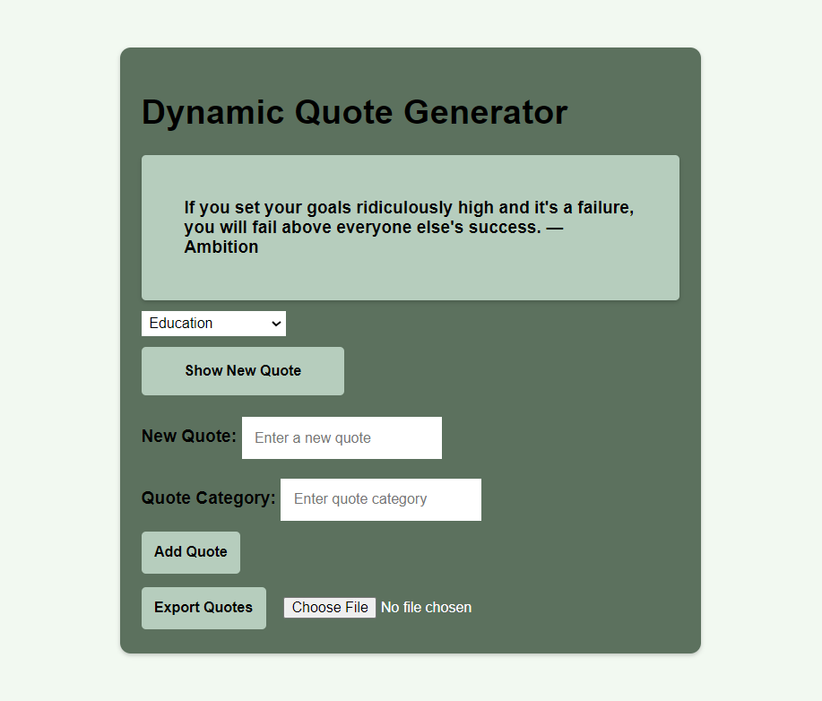

# **************************  DYNAMIC QUOTE GENERATOR ***********************

## OVERVIEW

The Dynamic Quote Generator is a web application that allows users to view, add, import, and export quotes. It features a dynamic content filtering system, enabling users to filter quotes by categories and manage them effectively through local storage.

## FEATURES

- Show Random Quotes: Display a random quote from a predefined list.
- Add New Quotes: Users can add new quotes with custom text and categories.
- Import/Export Quotes: Import quotes from a JSON file and export the current quotes to a JSON file.
- Dynamic Categories: Filter quotes based on selected categories.
- Local Storage: Persist stored quotes across browser sessions.

## Usage

1. Show Random Quote:
   - Click the "Show Random Quote" button to display a random quote.

2. Add New Quote:
   - Enter a quote and select a category.
   - Click "Add Quote" to add the new quote to the list.

3. Import Quotes:
   - Choose a JSON file with quotes and upload it to import.

4. Export Quotes:
   - Click "Export Quotes" to download the current quotes as a JSON file.

5. Filter Quotes:
   - Select a category from the dropdown to filter the displayed quotes.

## TECHNOLOGIES USED

- HTML: Structure and content of the web application.
- CSS: Styling and layout.
- JavaScript: Functionality and interaction.
- Local Storage: Storing quotes and user preferences.

# SCREENSHOT🖼️

## AUTHOR CONTACT INFORMATION
For any inquiries or further information, please feel free to reach out to me:

- Name: Abdulbasit Kayode Imam
- Email: abdulbasitkayode@gmail.com
- LinkedIn: [Abdul Basit Imam](https://www.linkedin.com/in/abdulbasitimam).